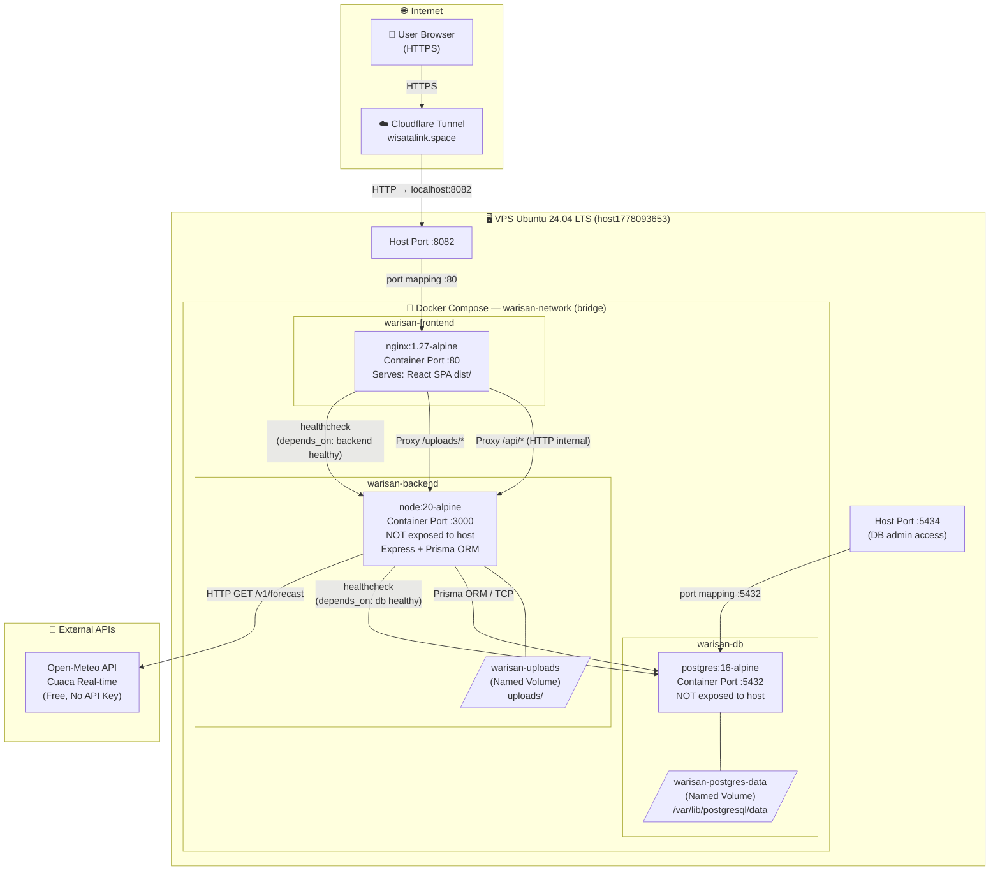

# Docker Architecture Diagram — WarisanLink



---

## Penjelasan Komponen

| Komponen | Image | Port | Volume | Keterangan |
|----------|-------|------|--------|------------|
| **warisan-frontend** | `nginx:1.27-alpine` | 8082 → 80 | — | Multi-stage build: node build React, nginx serve static + proxy |
| **warisan-backend** | `node:20-alpine` | internal :3000 | `warisan-uploads` | Express API + Prisma. Auto-migrate saat start |
| **warisan-db** | `postgres:16-alpine` | 5434 → 5432 | `warisan-postgres-data` | PostgreSQL self-hosted, persisten via named volume |

## Alur Request

```
Browser → Cloudflare Tunnel → Host :8082 → nginx (frontend container)
                                              ├─ GET / → serve React SPA (index.html)
                                              ├─ GET /api/* → proxy → backend:3000
                                              └─ GET /uploads/* → proxy → backend:3000/uploads/
```

## Startup Order (healthcheck)

```
1. warisan-db     → healthy (pg_isready)
2. warisan-backend → healthy (setelah migrate deploy + server start)
3. warisan-frontend → running (setelah backend healthy)
```

## Cara Docker Membantu Deployment

1. **Konsistensi lingkungan** — Node.js 20, PostgreSQL 16, nginx 1.27 selalu sama di dev dan production
2. **Isolasi port** — backend tidak di-expose ke host, hanya diakses via nginx internal
3. **Persistent data** — named volumes memastikan data DB dan uploads tidak hilang saat container restart
4. **Dependency ordering** — healthcheck memastikan DB siap sebelum backend start, backend healthy sebelum frontend start
5. **Multi-stage build** — frontend image hanya berisi nginx + dist/, bukan node_modules (lebih kecil)

## Port Allocation VPS (Tidak Konflik)

| Port Host | Service | Keterangan |
|-----------|---------|------------|
| 3000 | jobtracker-prod | Proyek lain |
| 3006 | *(freed)* | Sebelumnya warisan backend non-Docker |
| **8082** | **warisan-frontend** | **Cloudflare Tunnel target** |
| **5434** | **warisan-db** | **PostgreSQL host access** |
