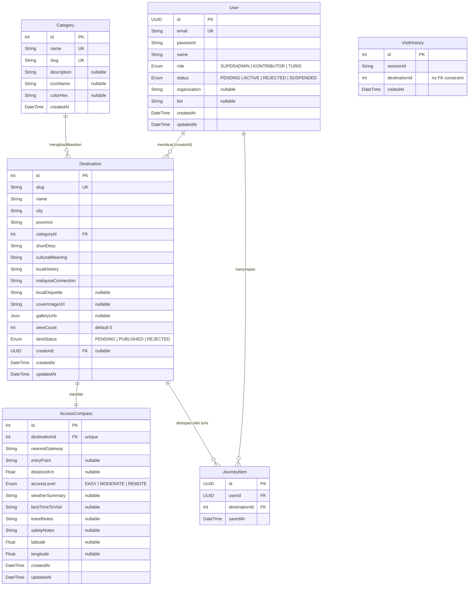

# Entity Relationship Diagram — WarisanLink

---

## Ringkasan Tabel

| Tabel | PK Type | Keterangan |
|-------|---------|------------|
| `User` | UUID | Semua role pengguna (Superadmin, Kontributor, Turis) |
| `Category` | Int (autoincrement) | Kategori destinasi budaya |
| `Destination` | Int (autoincrement) | Destinasi warisan budaya |
| `AccessCompass` | Int (autoincrement) | Info akses & lokasi per destinasi (1:1) |
| `JourneyItem` | UUID | Daftar simpan perjalanan milik Turis (m:n User-Destination) |
| `VisitHistory` | Int (autoincrement) | Log kunjungan anonim via sessionId (tanpa FK) |

## Relasi Utama

| Relasi | Kardinalitas | Keterangan |
|--------|-------------|------------|
| User → Destination | 1 : N | Satu Kontributor bisa upload banyak destinasi |
| Category → Destination | 1 : N | Satu kategori mencakup banyak destinasi |
| Destination → AccessCompass | 1 : 1 | Setiap destinasi punya tepat satu kompas akses |
| User → JourneyItem | 1 : N | Satu Turis bisa simpan banyak destinasi |
| Destination → JourneyItem | 1 : N | Satu destinasi bisa disimpan banyak Turis |
| JourneyItem (User+Destination) | M : N resolved | Unique constraint `[userId, destinationId]` |
