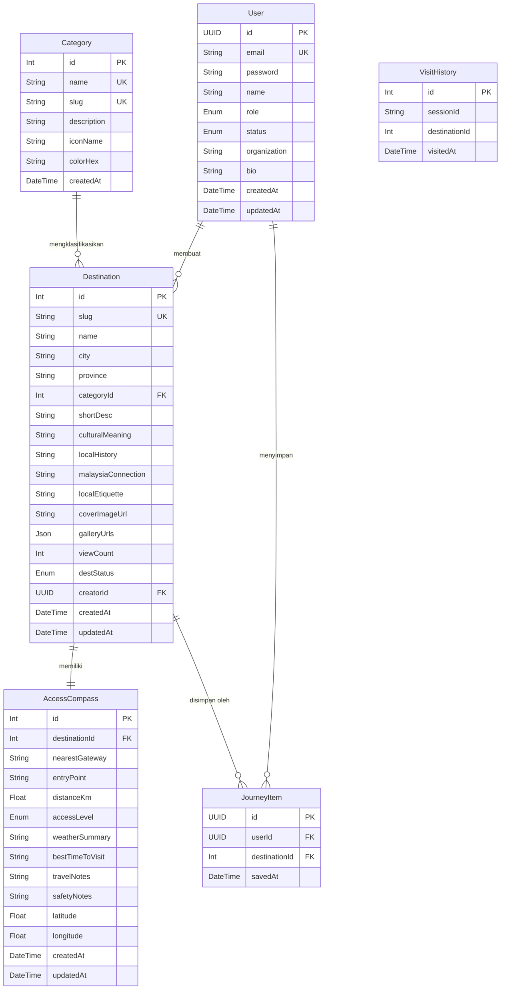

# Entity Relationship Diagram — WarisanLink

```mermaid
erDiagram

    User {
        UUID     id           PK
        String   email        UK
        String   password
        String   name
        Enum     role
        Enum     status
        String   organization
        String   bio
        DateTime createdAt
        DateTime updatedAt
    }

    Category {
        Int      id          PK
        String   name        UK
        String   slug        UK
        String   description
        String   iconName
        String   colorHex
        DateTime createdAt
    }

    Destination {
        Int      id                 PK
        String   slug               UK
        String   name
        String   city
        String   province
        Int      categoryId         FK
        String   shortDesc
        String   culturalMeaning
        String   localHistory
        String   malaysiaConnection
        String   localEtiquette
        String   coverImageUrl
        Json     galleryUrls
        Int      viewCount
        Enum     destStatus
        UUID     creatorId          FK
        DateTime createdAt
        DateTime updatedAt
    }

    AccessCompass {
        Int      id              PK
        Int      destinationId   FK
        String   nearestGateway
        String   entryPoint
        Float    distanceKm
        Enum     accessLevel
        String   weatherSummary
        String   bestTimeToVisit
        String   travelNotes
        String   safetyNotes
        Float    latitude
        Float    longitude
        DateTime createdAt
        DateTime updatedAt
    }

    JourneyItem {
        UUID     id            PK
        UUID     userId        FK
        Int      destinationId FK
        DateTime savedAt
    }

    VisitHistory {
        Int      id            PK
        String   sessionId
        Int      destinationId
        DateTime visitedAt
    }

    User         ||--o{ Destination   : "membuat"
    User         ||--o{ JourneyItem   : "menyimpan"
    Category     ||--o{ Destination   : "mengklasifikasikan"
    Destination  ||--|| AccessCompass : "memiliki"
    Destination  ||--o{ JourneyItem   : "disimpan oleh"
```
