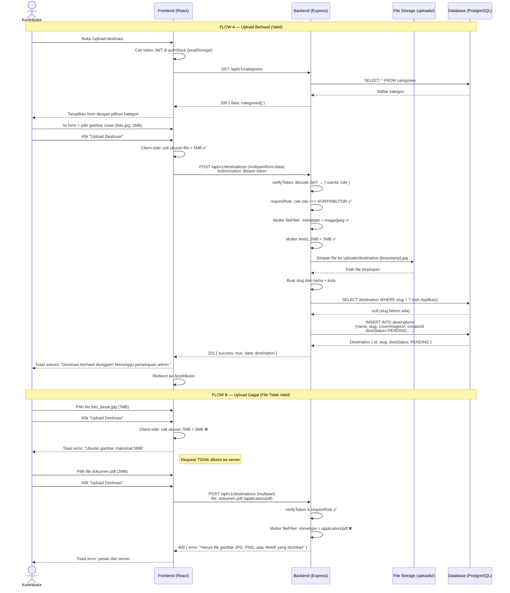

# Sequence Diagram 1 — Kontributor Upload Destinasi

**Aktor:** Kontributor (Produsen), Frontend (React), Backend (Express), File Storage (uploads/), Database (PostgreSQL)

---

---

## Penjelasan Alur

| Langkah | Komponen | Aksi |
|---------|----------|------|
| 1 | Frontend | Cek JWT di localStorage sebelum render form |
| 2 | Backend | verifyToken middleware decode JWT |
| 3 | Backend | requireRole middleware cek role KONTRIBUTOR |
| 4 | Multer | Validasi tipe file (whitelist: jpg, png, webp) |
| 5 | Multer | Validasi ukuran file (maks 5MB) |
| 6 | File Storage | Simpan file ke direktori uploads/ |
| 7 | Database | INSERT destinasi dengan status PENDING |
| 8 | Frontend | Redirect ke dashboard Kontributor |

**Keluaran valid:** Destinasi dengan `destStatus = PENDING` tersimpan di DB, file gambar tersimpan di `uploads/`.  
**Keluaran tidak valid:** Error 400 dengan pesan deskriptif, tidak ada perubahan di DB atau storage.
