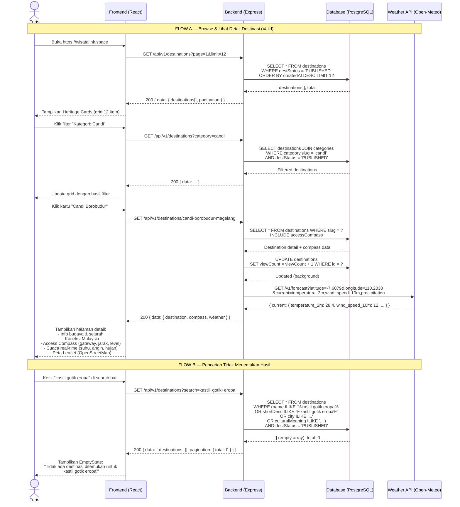

# Sequence Diagram 2 — Turis Akses Destinasi

**Aktor:** Turis (Konsumen), Frontend (React), Backend (Express), Database (PostgreSQL), Weather API (Open-Meteo)

---

---

## Penjelasan Alur

| Langkah | Komponen | Aksi |
|---------|----------|------|
| 1 | Backend | Filter `destStatus = PUBLISHED` — hanya konten yang sudah diapprove Superadmin |
| 2 | Backend | Pagination: skip/take dengan default 12 per halaman |
| 3 | Backend | `viewCount++` setiap kali halaman detail dibuka |
| 4 | Open-Meteo | Fetch cuaca real-time berdasarkan koordinat GPS dari Access Compass |
| 5 | Frontend | Render peta Leaflet dengan marker di koordinat destinasi |
| 6 | Backend | Full-text search di 5 field: name, shortDesc, city, province, culturalMeaning |

**Keluaran valid:** Halaman detail destinasi dengan info budaya, compass, cuaca aktual, dan peta interaktif.  
**Keluaran tidak valid (search):** EmptyState component dengan pesan informatif.

**Fitur unik WarisanLink:**
- Cuaca real-time via Open-Meteo API (gratis, tanpa API key)
- Narasi koneksi budaya Indonesia–Malaysia
- Access Compass: panduan akses transportasi + level kesulitan (EASY / MODERATE / REMOTE)
