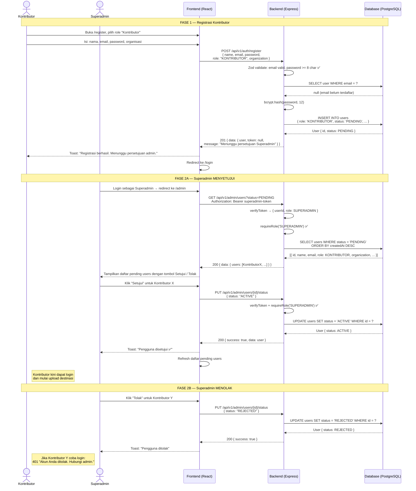

# Sequence Diagram 3 — Superadmin Approve/Reject Kontributor

**Aktor:** Kontributor, Superadmin, Frontend (React), Backend (Express), Database (PostgreSQL)

---

---

## Penjelasan Alur

| Langkah | Komponen | Aksi |
|---------|----------|------|
| 1 | Auth Service | Registrasi Kontributor: status default = PENDING |
| 2 | Auth Service | Registrasi Turis: status default = ACTIVE (langsung login) |
| 3 | JWT | Token TIDAK diberikan saat status PENDING |
| 4 | Admin API | GET /admin/users diproteksi verifyToken + requireRole(SUPERADMIN) |
| 5 | Admin Service | PUT status: validasi tidak boleh ubah diri sendiri |
| 6 | Login | Jika status REJECTED → 401 dengan pesan spesifik |

**Keluaran approve:** User.status = ACTIVE, Kontributor dapat login dan upload destinasi.  
**Keluaran reject:** User.status = REJECTED, login dikembalikan 401 dengan code ACCOUNT_REJECTED.
